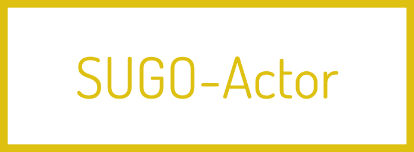

 


<!---
This file is generated by ape-tmpl. Do not update manually.
--->

<!-- Badge Start -->
<a name="badges"></a>

[![Build Status][bd_travis_com_shield_url]][bd_travis_com_url]
[![npm Version][bd_npm_shield_url]][bd_npm_url]
[![JS Standard][bd_standard_shield_url]][bd_standard_url]

[bd_repo_url]: https://github.com/realglobe-Inc/sugo-actor
[bd_travis_url]: http://travis-ci.org/realglobe-Inc/sugo-actor
[bd_travis_shield_url]: http://img.shields.io/travis/realglobe-Inc/sugo-actor.svg?style=flat
[bd_travis_com_url]: http://travis-ci.com/realglobe-Inc/sugo-actor
[bd_travis_com_shield_url]: https://api.travis-ci.com/realglobe-Inc/sugo-actor.svg?token=aeFzCpBZebyaRijpCFmm
[bd_license_url]: https://github.com/realglobe-Inc/sugo-actor/blob/master/LICENSE
[bd_codeclimate_url]: http://codeclimate.com/github/realglobe-Inc/sugo-actor
[bd_codeclimate_shield_url]: http://img.shields.io/codeclimate/github/realglobe-Inc/sugo-actor.svg?style=flat
[bd_codeclimate_coverage_shield_url]: http://img.shields.io/codeclimate/coverage/github/realglobe-Inc/sugo-actor.svg?style=flat
[bd_gemnasium_url]: https://gemnasium.com/realglobe-Inc/sugo-actor
[bd_gemnasium_shield_url]: https://gemnasium.com/realglobe-Inc/sugo-actor.svg
[bd_npm_url]: http://www.npmjs.org/package/sugo-actor
[bd_npm_shield_url]: http://img.shields.io/npm/v/sugo-actor.svg?style=flat
[bd_standard_url]: http://standardjs.com/
[bd_standard_shield_url]: https://img.shields.io/badge/code%20style-standard-brightgreen.svg

<!-- Badge End -->


<!-- Description Start -->
<a name="description"></a>

Function provider client of SUGOS.

<!-- Description End -->


<!-- Overview Start -->
<a name="overview"></a>


<!-- Overview End -->


<!-- Sections Start -->
<a name="sections"></a>

<!-- Section from "doc/guides/00.Requirements.md.hbs" Start -->

<a name="section-doc-guides-00-requirements-md"></a>
Requirements
-----

<a href="https://nodejs.org">
  </a>
<a href="https://docs.npmjs.com/">
  </a>

+ [Node.js ( >=6.x )][node_download_url]
+ [npm ( >=3.x )][npm_url]

[node_download_url]: https://nodejs.org/en/download/
[npm_url]: https://docs.npmjs.com/


<!-- Section from "doc/guides/00.Requirements.md.hbs" End -->

<!-- Section from "doc/guides/01.Installation.md.hbs" Start -->

<a name="section-doc-guides-01-installation-md"></a>
Installation
-----

```bash
$ npm install sugo-actor --save
```


<!-- Section from "doc/guides/01.Installation.md.hbs" End -->

<!-- Section from "doc/guides/02.Usage.md.hbs" Start -->

<a name="section-doc-guides-02-usage-md"></a>
Usage
---------

```javascript
#!/usr/bin/env node

/**
 * This is an example to run actor
 */

'use strict'

const sugoActor = require('sugo-actor')
const co = require('co')

const CLOUD_URL = 'http://my-sugo-cloud.example.com/actors'

co(function * () {
  let actor = sugoActor(CLOUD_URL, {
    key: 'my-actor-01',
    modules: {
      // Declare custom function
      ping (ctx) {
        let { params } = ctx
        let [ pong ] = params // Parameters passed from caller
        return co(function * () {
          /* ... */
          return pong // Return value to pass caller
        })
      },
      // Use module plugin
      shell: require('sugo-module-shell')({})
    }
  })

// Connect to cloud server
  yield actor.connect()
}).catch((err) => console.error(err))

```


<!-- Section from "doc/guides/02.Usage.md.hbs" End -->

<!-- Section from "doc/guides/03.Advanced Usage.md.hbs" Start -->

<a name="section-doc-guides-03-advanced-usage-md"></a>
Advanced Usage
---------

Interfaces may have event emitting/listening so that you can implement none call-return functionality like file watching

```javascript
#!/usr/bin/env node

'use strict'

const sugoActor = require('sugo-actor')
const co = require('co')
const fs = require('fs')

co(function * () {
  let actor = sugoActor('http://my-sugo-cloud.example.com/actors', {
    key: 'my-actor-01',
    modules: {
      sample01: {
        // File watch with event emitter
        watchFile (ctx) {
          //  ctx.pipe is an instance of EventEmitter class
          let { params, pipe } = ctx
          let [ pattern ] = params
          return co(function * () {
            let watcher = fs.watch(pattern, (event, filename) => {
              // Emit event to remote terminal
              pipe.on('change', { event, filename })
            })
            // Receive event from remote terminal
            pipe.on('stop', () => {
              watcher.close()
            })
          })
        },
        /**
         * Module specification.
         * @see https://github.com/realglobe-Inc/sg-schemas/blob/master/lib/module_spec.json
         */
        $spec: {
          name: 'sugo-demo-actor-sample',
          version: '1.0.0',
          desc: 'An example method',
          methods: {
            watchFile: {
              params: [
                { name: 'pattern', desc: 'Glob pattern files to watch' }
              ]
            }
          }
        }
      }
    }
  })

// Connect to cloud server
  yield actor.connect()
}).catch((err) => console.error(err))

```


<!-- Section from "doc/guides/03.Advanced Usage.md.hbs" End -->


<!-- Sections Start -->


<!-- LICENSE Start -->
<a name="license"></a>

License
-------
This software is released under the [Apache-2.0 License](https://github.com/realglobe-Inc/sugo-actor/blob/master/LICENSE).

<!-- LICENSE End -->


<!-- Links Start -->
<a name="links"></a>

Links
------

+ [sugos][sugos_url]
+ [sugo-cloud][sugo_cloud_url]
+ [sugo-caller][sugo_caller_url]

[sugos_url]: https://github.com/realglobe-Inc/sugos
[sugo_cloud_url]: https://github.com/realglobe-Inc/sugo-cloud
[sugo_caller_url]: https://github.com/realglobe-Inc/sugo-caller

<!-- Links End -->
